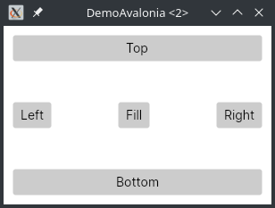

# DemoAvalonia

Demo app written with the [Avalonia User Interface Tookit](http://avaloniaui.net).

## Screenshots

.

.

## Installation and run

This demo is writeen using Rider. However, you can ignore that and use:

    $ dotnet run

And the application will build & run. Of course, you need to have [Microsoft .NET Core](http://dotnet.microsoft.com/) installed.

## License

Under the [MIT License](LICENSE).
